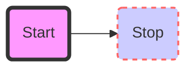
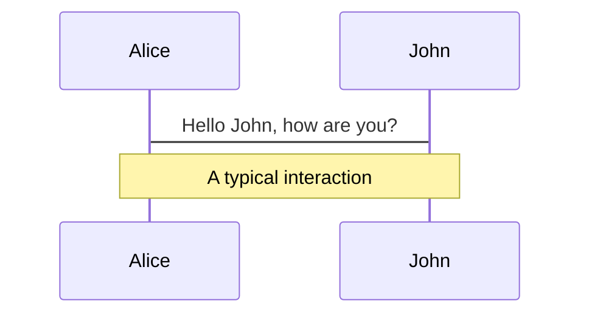

test 2

$$
f(x) = \int_{-\infty}^\infty
    \hat f(\xi)\,e^{2 \pi i \xi x}
    \,d\xi
$$

test 3

$$

\displaystyle \left( \sum_{k=1}^n a_k b_k \right)^2 \leq \left( \sum_{k=1}^n a_k^2 \right) \left( \sum_{k=1}^n b_k^2 \right)

$$


test 123
------------------------------------------


### test test test 123456

# test


::: warning
*here be dragons*
:::


# Maxwell's Equations


equation | description
----------|------------
$\nabla \cdot \vec{\mathbf{B}}  = 0$ | divergence of $\vec{\mathbf{B}}$ is zero
$\nabla \times \vec{\mathbf{E}}\, +\, \frac1c\, \frac{\partial\vec{\mathbf{B}}}{\partial t}  = \vec{\mathbf{0}}$ |  curl of $\vec{\mathbf{E}}$ is proportional to the rate of change of $\vec{\mathbf{B}}$
$\nabla \times \vec{\mathbf{B}} -\, \frac1c\, \frac{\partial\vec{\mathbf{E}}}{\partial t} = \frac{4\pi}{c}\vec{\mathbf{j}}    \nabla \cdot \vec{\mathbf{E}} = 4 \pi \rho$ | _wha?_


## What is Lorem Ipsum?

```shaky
       +------------+     +------------+
       |            |     |            |
       |  CONTEXT   |<-+  |  CONTEXT   |<-+
       |            |  |  |            |  |
       |            |  |  |            |  |
       |     *------+--+  |     *------+--+
       |     *      |     |     *      |
       +-----+------+     +-----+------+
             |                  |
             +----------+-------+
                        |
                        v
             +------------------------+
             |  Test Shaky Integration|
             |            *           |
             +------------+-----------+
                          |
                          v
             +--------------------+
             |  unoptimized Code  |
             |                    |
      ??? <--+---* getX call      |
             |                    |
      ??? <--+---* getY call      |
             |                    |
             +--------------------+
```

> this is quote. _really_ - it supports **inline** markdown

Lorem Ipsum is simply dummy text of the printing and typesetting industry. Lorem Ipsum has been the industry's standard dummy text ever since the 1500s, when an unknown printer took a galley of type and scrambled it to make a type specimen book. It has survived not only five centuries, but also the leap into electronic typesetting, remaining essentially unchanged. It was popularised in the 1960s with the release of Letraset sheets containing Lorem Ipsum passages, and more recently with desktop publishing software like Aldus PageMaker including versions of Lorem Ipsum.

```run-dot
digraph G {
        a1 [id=a1 shape=rectangle];
        a2 [id=a2 shape=rectangle];
        a3 [id=a3 shape=rectangle];
        a4 [id=a4 shape=rectangle];
        a5 [id=a5 shape=rectangle];
        a1 -> a5;
        a2 -> a1;
        a2 -> a5;
        a3 -> a2;
        a4 -> a2;
        a4 -> a4;
}
```

## Why do we use it?

It is a long established fact that a reader will be distracted by the readable content of a page when looking at its layout. The point of using Lorem Ipsum is that it has a more-or-less normal distribution of letters, as opposed to using 'Content here, content here', making it look like readable English. Many desktop publishing packages and web page editors now use Lorem Ipsum as their default model text, and a search for 'lorem ipsum' will uncover many web sites still in their infancy. Various versions have evolved over the years, sometimes by accident, sometimes on purpose (injected humour and the like).

```run-gnuplot
plot sin(x) w l lc rgb"#ff0000", cos(x) w l lc rgb"#00ff00"
```

## Where does it come from?

```railroad
Diagram(
  Optional('+', 'skip'),
  Choice(0,
    NonTerminal('name-char'),
    NonTerminal('escape')),
  ZeroOrMore(
    Choice(0,
      NonTerminal('name char'),
      NonTerminal('escape'))))
```

Contrary to popular belief, Lorem Ipsum is not simply random text. It has roots in a piece of classical Latin literature from 45 BC, making it over 2000 years old. Richard McClintock, a Latin professor at Hampden-Sydney College in Virginia,

```run-gnuplot
set format x "%.1f"
set format y "%.1f"
set label 1 "Superscripts and subscripts:" at -0.65, 0.95, 0 left norotate back textcolor lt 3 nopoint
set label 3 "A_{j,k} 10^{-2}  x@^2_k    x@_0^{-3/2}y" at -0.55, 0.85, 0 left norotate back nopoint
set label 5 "Space-holders:" at -0.55, 0.7, 0 left norotate back textcolor lt 3 nopoint
set label 6 "<&{{/=20 B}ig}> <&{x@_0^{-3/2}y}> holds space for" at -0.45, 0.6, 0 left norotate back nopoint
set label 7 "<{{/=20 B}ig}> <{x@_0^{-3/2}y}>" at -0.45, 0.5, 0 left norotate back nopoint
set label 8 "Overprint\n(v should be centred over d)" at -0.9, -0.2, 0 left norotate back textcolor lt 3 nopoint
set label 9 " ~{abcdefg}{0.8v}" at -0.85, -0.4, 0 left norotate back nopoint
set label 10 "UTF-8 encoding does not require Symbol font:" at -0.4, 0.35, 0 left norotate back textcolor lt 3 nopoint
set label 11 "{/*1.5 ∫@_{/=9.6 0}^{/=12 ∞}} {e^{-{μ}^2/2} d}{μ=(π/2)^{1/2}}" at -0.3, 0.2, 0 left norotate back nopoint
set label 21 "Left  ^{centered} ƒ(αβγδεζ)" at 0.5, -0.1, 0 left norotate back nopoint
set label 22 "Right ^{centered} ƒ(αβγδεζ)" at 0.5, -0.2, 0 right norotate back nopoint
set label 23 "Center^{centered} ƒ(αβγδεζ)" at 0.5, -0.3, 0 centre norotate back nopoint
set label 30 "{/:Bold Bold} and {/:Italic Italic} markup" at -0.9, 0, 0 left norotate back nopoint
set arrow 1 from 0.5, -0.5, 0 to 0.5, 0, 0 nohead back nofilled lt black linewidth 1.000
set style data lines
set title "Demo of enhanced text mode using a single UTF-8 encoded font\nThere is another demo that shows how to use a separate Symbol font"
set xrange [ -1.00000 : 1.00000 ] noreverse nowriteback
set yrange [ -0.500000 : 1.10000 ] noreverse nowriteback
save_encoding = "utf8"
plot sin(x)**2 lt 2 lw 2 title "sin^2(x)"
```

 looked up one of the more obscure Latin words, consectetur, from a Lorem Ipsum passage, and going through the cites of the word in classical literature, discovered the undoubtable source. Lorem Ipsum comes from sections 1.10.32 and 1.10.33 of




 "de Finibus Bonorum et Malorum" (The Extremes of Good and Evil) by Cicero, written in 45 BC. This book is a treatise on the theory of ethics, very popular during the Renaissance. The first line of Lorem Ipsum, "Lorem ipsum dolor sit amet..", comes from a line in section 1.10.32.



The standard chunk of Lorem Ipsum used since the 1500s is reproduced below for those interested. Sections 1.10.32 and 1.10.33 from "de Finibus Bonorum et Malorum" by Cicero are also reproduced in their exact original form, accompanied by English versions from the 1914 translation by H. Rackham.
