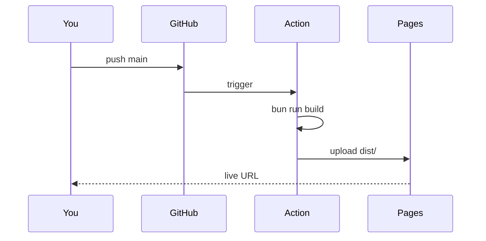

I've started, abandoned, and resurrected this blog more times than I can
count. The pattern is always the same: I pick a tool, configure it for a
weekend, write one post, and then never come back.

## The trap

Most blog tooling optimizes for the **reader** before there's a single
reader. Themes, comments, analytics dashboards, edge functions — nice
problems to have, except none of them help you ship a post on a Tuesday
evening.

## What I want instead

<Steps>
  <Step title="Open the repo">A folder. No login.</Step>
  <Step title="Make a file">`content/posts/<date>-<slug>.mdx`. Frontmatter, words.</Step>
  <Step title="Push">CI builds and deploys. No clicks.</Step>
</Steps>

## How this site works

1. Posts are local **MDX** files. They're part of the repo.
2. **Vite** + a small remark plugin extracts a TOC and reading time at
   build time, so the rendered post can ship a sticky outline and a
   "5 min read" label without any client-side parsing.
3. **Shiki** does syntax highlighting at build time, also.
4. A **GitHub Action** runs `bun run build` and pushes `dist/` to GitHub
   Pages. The whole pipeline is one YAML file.

```yaml
name: Deploy
on:
  push: { branches: [main] }
jobs:
  build:
    # ... see .github/workflows/deploy.yml
```

<Callout type="info">
  The point isn't any one of these choices — it's that they compose into a
  workflow that gets out of your way.
</Callout>

## A tiny diagram, because why not



That's the whole thing. Now I just have to actually write.
