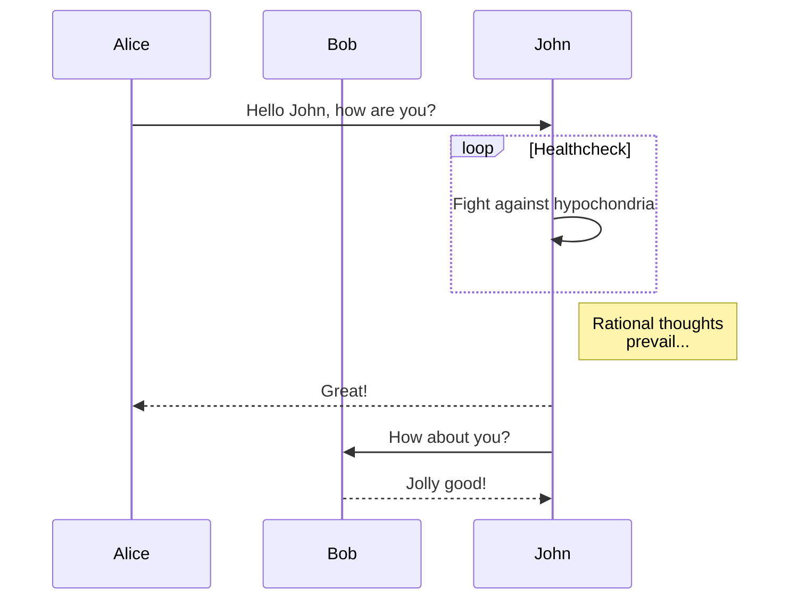

```json
{
  "title": "Test Title",
  "author": "Andrey Sidorov",
  "tags": ["dbus", "node.js", "blah"]
}
```

## Currently supported fence-to-svg converters

- shaky ( via [shaky](https://github.com/ShawnHuang/shaky) via [shaky.coffee](https://github.com/dbushong/shaky) via [shaky-dart](http://mrale.ph/blog/2012/11/25/shaky-diagramming.html)
- run-dot ( [graphviz](http://www.graphviz.org/content/dot-language) directly to svg)
- run-gnuplot ( gnuplot using [svg terminal](http://gnuplot.sourceforge.net/demo_svg_5.0/) )
- railroad ( using [railroad-diagrams](https://github.com/tabatkins/railroad-diagrams))
- run-latex ( latex -> dvi -> [dvisvgm](http://dvisvgm.bplaced.net/) )
- run-css - inject style block into page
- run-cmx - render http://cmx.io/ comic ( using phantom.js )
- mermaid - render [mermaid diagram](https://github.com/knsv/mermaid)

# examples



rr

```railroad
Diagram(
  Optional('+', 'skip'),
  Choice(0,
    NonTerminal('name-start char'),
    NonTerminal('escape')),
  ZeroOrMore(
    Choice(0,
      NonTerminal('name char'),
      NonTerminal('escape'))))
```

```run-cmx
<scene id="scene1">
<label t="translate(0,346)">
  <tspan x="0" y="0em">One lazy morning</tspan>
</label>
<drawing t="translate(0,31)">
  <line stroke="green">
    <point x="0" y="0"></point>
    <point x="250" y="20"></point>
  </line>
</drawing>
<actor t="translate(71,19) rotate(-2)" pose="-11,9|-5,117|-11,99|-11,89|-11,79|-11,59|-16,34|-21,9|-6,34|-1,9|-18,79|-18,59|-6,79|-1,59">
  <bubble t="translate(9,11)" pose="0,0|-20,10|-81,49|19,66|-21,145|-73,109">
    <tspan x="0" y="-3em">I had an idea today</tspan>
    <tspan x="0" y="0em">anyone without</tspan>
    <tspan x="0" y="1em">much talent</tspan>
    <tspan x="0" y="2em">could publish</tspan>
    <tspan x="0" y="3em">comix strips...</tspan>
    <tspan x="8" y="76px">easily!</tspan>
  </bubble>
</actor>
<actor t="translate(159,15)" pose="28,1|30,109|28,91|28,81|28,71|28,51|18,31|18,1|33,26|38,1|23,71|18,51|38,71|38,51">
  <bubble t="translate(-2,-9)" pose="0,0|-14,24|-36,69|27,28|8,72|-35,93">
    <tspan x="0" y="0em">you mean</tspan>
    <tspan x="0" y="1em">as easily as</tspan>
    <tspan x="0" y="2em">blogging!?</tspan>
  </bubble>
</actor>
</scene>

<scene id="scene2">
<drawing t="translate(0,31)">
  <line stroke="green">
    <point x="0" y="0"></point>
    <point x="250" y="20"></point>
  </line>
</drawing>
<actor t="translate(71,19) rotate(-2)" pose="-11,9|-1,114|-11,99|-11,89|-11,79|-11,59|-16,34|-21,9|-6,34|-1,9|-18,79|-18,59|-6,79|13,83">
  <bubble t="translate(-3,0)" pose="0,0|-12,22|-83,104|45,21|-37,182|-58,162">
    <tspan x="0" y="-2em">Yes!
    <tspan x="0" y="0em">people would use</tspan>
    <tspan x="0" y="1em">simple HTML markup</tspan>
    <tspan x="0" y="2em">and collaborate</tspan>
    <tspan x="0" y="3em">on <tspan fill="blue">github</tspan></tspan>
  </tspan></bubble>
</actor>
<actor t="translate(159,15)" pose="28,1|30,109|28,91|28,81|28,71|28,51|18,31|13,1|33,26|38,1|23,71|18,51|38,71|38,51">
  <bubble t="translate(-2,-9)" pose="0,0|7,33|14,66|-63,30|-52,62|-94,113">
    <tspan x="0" y="1em">hmm, cool! that</tspan>
    <tspan x="0" y="2em">sounds like an easy</tspan>
    <tspan x="0" y="3em" fill="red">weekend project</tspan>
  </bubble>
</actor>
</scene>

<scene id="scene3" height="230">
<label t="translate(0,225)">
  <tspan x="0" y="0em">A few months later</tspan>
</label>
<actor t="translate(209,4) rotate(2)" pose="-41,48|-10,105|0,88|0,78|0,68|0,48|-5,23|-10,-2|5,23|10,-2|-11,70|-4,54|17,86|-4,110">
  <bubble t="translate(-2,-9)" pose="0,0|-13,24|-29,52|-86,-4|-99,79|-165,70">
    <tspan x="0" y="-1em">hey! I've finally done it</tspan>
    <tspan x="0" y="1em">Now I just wonder</tspan>
    <tspan x="0" y="2em">how many collective</tspan>
    <tspan x="0" y="3em" fill="red">work hours</tspan>
    <tspan x="0" y="4em" fill="red">will be wasted</tspan>
    <tspan x="0" y="5em" fill="red">when I publish it</tspan>
  </bubble>
</actor>
</scene>

<scene id="scene4" width="300" height="98" margin-y="3" frame="no">
<label t="translate(28,88)" pose="0,0|1,-9">
  <tspan x="0" y="0em">~ comix markup</tspan>
  <tspan x="0" y="1em">~ can be mixed with HTML</tspan>
  <tspan x="0" y="2em">~ WYSIWYG editor</tspan>
  <tspan x="0" y="3em">~ open-source</tspan>
  <tspan x="0" y="4em">~ backed by </tspan><tspan fill="blue">gist.github.com</tspan>
</label>
<actor t="translate(192,29)" pose="73,-56|69,46|73,34|93,22|81,12|82,1|66,-10|63,-39|79,-16|92,-30|63,19|42,19|65,11|40,6">
</actor>
</scene>
```

## svgbob

```svgbob
 o->  Sequence Diagrams
                                   .--->  F
          A       B      C  D     /
          *-------*-----*---*----*----->  E
                   \            ^ \
                    v          /   '--->  G
                     B --> C -'
```

## run-latex:

```run-latex
% Focused ion beam system
% Author: Clemens Helfmeier
\documentclass{minimal}
\usepackage[utf8]{inputenc}
\usepackage{tikz}
\usetikzlibrary{arrows,decorations.pathmorphing}
\def\english#1{\emph{#1}}
\tikzset{
  arrow/.style={-stealth', line width=0.5pt},
  every picture/.append style={line width=1pt},
}
\begin{document}
\pagestyle{empty}
\begin{tikzpicture}[
    scale=1.3,
    fib housing horz/.style={top color=black!10, bottom color=black!40, draw=black!50},
    fib housing vert/.style={left color=black!10, right color=black!40, draw=black!50},
    fib housing/.style={fill=black!20, draw=black!50},
    fib background vert/.style={left color=black!40, right color=black!10, draw=black!50},
    fib background/.style={fill=black!30, draw=black!50},
    fib lens thick/.style={draw=black!80, line width=0.04cm},
    fib lens thinn/.style={draw=black!95, line width=0.02cm},
    fib mirror/.style={draw=black!60, line width=0.03cm, fill=black!20},
    fib objective/.style={draw=black!60, line width=0.03cm},
    fib quadrupole/.style={draw=black!60, line width=0.03cm},
    fib blanker/.style={draw=black!90, fill=black!60},
    fib octopole/.style={draw=black!80, line width=0.04cm},
  ]
  % Picture created and copyright by Clemens Helfmeier in 2009 for master thesis.
  % Contact me at: Clemens@Helfmeier.de
  % Aufbau des FIBs
  % "falsch" herum, Probe unten, Ionen oben
  % einzelne Elemente sind rund, insofern auch shading anbringen
  % jedes element ist 1.4cm hoch.
  % Die FIB-Säule
  \begin{scope}[scale=2]
    \begin{scope}[yshift=0.2]
      %% Ionenquelle
      { % Rückseite
        \path[fib background vert]
          (-1,0) arc (180:360:1 and 0.05) -- (1,-1) arc (360:180:1 and 0.05) --cycle;
        \path[fib background vert]
          (-0.8,0.2) arc (180:360:0.8 and 0.04) -- (1,0) arc (360:180:1 and 0.05) --cycle;
        \path[fib background vert]
          (-0.8,-1.2) arc (180:360:0.8 and 0.04) -- (1,-1) arc (360:180:1 and 0.05) --cycle;
      }
      { % Innenleben
        \path[fib housing vert]
          (-0.3,0) -- (0.3,0) -- (0.3,-0.45) -- (0,-0.7) coordinate (source) -- (-0.3,-0.45) --cycle;
        \path[draw=black!80, yslant=-0.1]
          \foreach \x in {0.1,0.2,0.3,0.4} {
            (-0.3,-\x) arc(210:-30:0.35 and 0.06)
          };
        \path[fib lens thinn]
          (-0.8,-0.9) -- (-0.05,-0.9)
          (0,-0.9) coordinate (emitter)
          (0.05,-0.9) -- (0.8,-0.9) coordinate[midway] (extractor);
        \path[fib lens thick]
          (-0.4,-0.4) -- (-0.4,-0.8) -- (-0.1,-0.8) (0.1,-0.8) -- (0.4,-0.8) -- (0.4,-0.4) coordinate[midway] (suppressor);
      }
      \begin{scope} % Gehäuse
        \path[clip,decoration={random steps, segment length=6pt, amplitude=2pt}]
          (-1,0.3) -- (1,0.3) -- (1,-1.3)
          -- (0.6,-1.3) decorate{ ..controls (0.6,0.2) and (-0.6,0.2).. (-0.6,-1.3)}
          -- (-1,-1.3) --cycle;
        \path[fib housing vert]
          (-1,0) arc (180:0:1 and 0.05) -- (1,-1) arc (0:180:1 and 0.05) --cycle;
        \path[fib housing vert]
          (-0.8,0.2) arc (180:0:0.8 and 0.04) -- (1,0) arc (0:180:1 and 0.05) --cycle;
        \path[fib housing vert]
          (-0.8,-1.2) arc (180:0:0.8 and 0.04) -- (1,-1) arc (0:180:1 and 0.05) --cycle;
        \path[fib housing]
          (0,-1.2) ellipse (0.8 and 0.04);
      \end{scope}
      { % Ionenpumpe extern
        \path[fib housing]
          (-1,-0.1) rectangle (-1.2,-0.6);
        \path[fib housing]
          (-1.2,-0.15) rectangle (-1.25,-0.2)
          (-1.2,-0.55) rectangle (-1.25,-0.5);
        \path[fib housing horz]
          (-1.2,-0.25) rectangle (-1.6,-0.45);
      }
    \end{scope}
    %% Beschleunigung und fokussierung
    \begin{scope}[yshift=-1.4cm]
      { % Rückseite
        \path[fib background vert]
          (-0.7,0.2) arc (180:360:0.7 and 0.03) -- (0.7,-1.2) arc (360:180:0.7 and 0.03) --cycle;
      }
      { % Innenleben
        \path[fib lens thinn] % Linse
          (-0.3,-0.25) -- (-0.5,-0.25) -- (-0.5,-0.35) -- (-0.3,-0.35)
          (0.3,-0.25) -- (0.5,-0.25) -- (0.5,-0.35) -- (0.3,-0.35);
        \path[fib lens thick]
          (-0.45,-0.3) -- (-0.35,-0.3) (0.35,-0.3) -- (0.45,-0.3)
          (0,-0.3) coordinate (ionlens1)
          (-0.5,-0.25) coordinate (linse1);
        \path[fib quadrupole] % quadrupole 1
          (0,-0.45) ellipse (0.33cm and 0.01cm)
          (0,-0.65) ellipse (0.33cm and 0.01cm)
          (-0.35,-0.45) -- ++(0,-0.2) (-0.2,-0.45) -- ++(0,-0.2)
          (0.35,-0.45) -- ++(0,-0.2) (0.2,-0.45) -- ++(0,-0.2)
          (-0.35,-0.45) coordinate (quadA);
        \path[fib lens thick]
          (-0.25,-0.45) -- (0.25,-0.45)
          (-0.25,-0.65) -- (0.25,-0.65);
        \path[fib lens thick] % Blende
          (-0.7,-0.75) -- (-0.05,-0.75) (0.05,-0.75) -- (0.7,-0.75) coordinate[midway] (blende)
          (0,-0.75) coordinate (ionblende);
        \path[fib quadrupole] % quadrupole 2
          (0,-0.85) ellipse (0.33cm and 0.01cm)
          (0,-1.05) ellipse (0.33cm and 0.01cm)
          (-0.35,-0.85) -- ++(0,-0.2) (-0.2,-0.85) -- ++(0,-0.2)
          (0.35,-0.85) -- ++(0,-0.2) (0.2,-0.85) -- ++(0,-0.2)
          (-0.35,-0.85) coordinate (quadB);
        \path[fib lens thick]
          (-0.25,-0.85) -- (0.25,-0.85)
          (-0.25,-1.05) -- (0.25,-1.05);
      }
      \begin{scope} % Gehäuse
        \path[clip,decoration={random steps, segment length=6pt, amplitude=2pt}]
          (0.7,0.3) -- (0.7,-1.3)
          -- (0.6,-1.3) decorate{ ..controls (0.5,-0.6).. (0.6,0.3)} --cycle
          (-0.7,0.3) -- (-0.6,0.3) decorate{ ..controls (-0.5,-0.6).. (-0.6,-1.3)}
          -- (-0.7,-1.3) --cycle;
        \path[fib housing vert]
          (-0.7,0.2) arc (180:0:0.7 and 0.03) -- (0.7,-1.2) arc (0:180:0.7 and 0.03) --cycle;
      \end{scope}
      { % Ionenpumpe extern
        \path[fib housing]
          (0.7,-0.1) rectangle (0.9,-0.6);
        \path[fib housing]
          (0.9,-0.15) rectangle (0.95,-0.2) (0.95,-0.15) coordinate (ionenpume)
          (0.9,-0.55) rectangle (0.95,-0.5);
        \path[fib housing horz]
          (0.9,-0.25) rectangle (1.3,-0.45);
      }
    \end{scope}
    \begin{scope}[yshift=-2.8cm]
      % Optik und Ablenkteile
      { %Rückseite
        \path[fib background vert]
          (-0.8,0.2) arc (180:360:0.8 and 0.03) -- (0.8,-1.5) arc (360:180:0.8 and 0.03) --cycle;
        \path[fib background]
          (1.3,0.3) rectangle (2.4,-1.1);
      }
      { % Innenleben
        \path[fib blanker] % blanker
          (-0.3,0.1) rectangle (-0.25,-0.2)
          (0.3,0.1) rectangle (0.25,-0.2)
          (-0.3,0.1) coordinate (blanker);
        \path[fib lens thick]
          (-0.3,-0.05) -- (-0.4,-0.05) (0.3,-0.05) -- (0.4,-0.05);
        \path[fib lens thick] % Faradaykäfig
          (-0.3,-0.25) -- (-0.3,-0.35) -- (-0.15,-0.35) -- (-0.15,-0.25)
          (-0.3,-0.25) coordinate (faraday)
          (0.3,-0.25) -- (0.3,-0.35) -- (0.15,-0.35) -- (0.15,-0.25);
        \path[fib octopole] % octopole 1
          (0,-0.4) ellipse (0.38cm and 0.01cm)
          (0,-0.6) ellipse (0.38cm and 0.01cm)
          (-0.4,-0.4) -- (-0.4,-0.6) (0.4,-0.4) -- (0.4,-0.6)
          (-0.27,-0.4) -- ++(0,-0.2) (-0.1,-0.4) -- ++(0,-0.2)
          (0.27,-0.4) -- ++(0,-0.2) (0.1,-0.4) -- ++(0,-0.2)
          (0,-0.5) coordinate (ionocto1)
          (-0.4,-0.4) coordinate (octoA);
        \path[fib octopole] % octopole 2
          (0,-0.7) ellipse (0.38cm and 0.01cm)
          (0,-1.05) ellipse (0.38cm and 0.01cm)
          (-0.4,-0.7) -- (-0.4,-1.05) (0.4,-0.7) -- (0.4,-1.05)
          (-0.27,-0.7) -- ++(0,-0.35) (-0.1,-0.7) -- ++(0,-0.35)
          (0.27,-0.7) -- ++(0,-0.35) (0.1,-0.7) -- ++(0,-0.35)
          (0,-0.88) coordinate (ionocto2)
          (-0.4,-0.7) coordinate (octoB);
        \path[fib mirror]
          (0.4,-0.4) -- (0.6,-0.2) -- (0.4,-0.2) -- cycle;
        \path[fib mirror]
          (0.6,-1.2) -- (0.4,-1.4) -- (0.6,-1.4) -- cycle;
        \path[fib mirror]
          (-0.1,-1.4) -- (-0.025,-1.325) (0.025,-1.275) -- (0.1,-1.2) -- cycle;
        \path[fib mirror] % kamera innenleben
          (1.6,-0.2) -- (1.8,-0.4);
        \path[fib lens thinn]
          (1.6,-0.6) arc(100:80:0.575) arc(-80:-100:0.575) -- cycle;
        \path[draw=black!60, fill=black!20]
          (1.58,-0.82) -- (1.56,-0.97) -- (1.82,-0.97) -- (1.84,-0.82) --cycle;
        \path[draw=black!60, shading=ball, ball color=black!30]
          (1.7,-0.9) ellipse (0.1cm and 0.05cm);
        \begin{scope}
          \path[clip]
            (2.2,-0.3) circle (0.1cm);
          \path[draw=black!80, line width=0.04cm]
            (2.2,-0.3) circle (0.1cm)
            (2.1,-0.2) -- (2.3,-0.4)
            (2.1,-0.4) -- (2.3,-0.2);
        \end{scope}
        \path[fib lens thinn]
          (1.9,-0.2) arc(170:190:0.575) arc(-10:10:0.575) -- cycle;
      }
      \begin{scope} % externes Gehäuse
        \path[clip,decoration={random steps, segment length=6pt, amplitude=2pt}]
          (0.8,0) -- (1.3,0) -- (1.3,0.3) -- (2.4,0.3) -- (2.4,-1.1) -- (1.3,-1.1) -- (1.3,-0.6) -- (0.8,-0.6) -- (0.8,-0.1) -- (1.4,-0.1)
          decorate{ .. controls (1.4,-0.5) .. (1.6,-1) .. controls (2.3,-1) .. (2.3,-0.1) .. controls (1.8,0.2) .. (1.4,0)}
          -- (1.4,-0.1) -- (0.8,-0.1) --cycle;
        \path[fib housing horz]
          (0.8,0) rectangle (1.3,-0.6);
        \path[fib housing]
          (1.3,0.3) rectangle (2.4,-1.1);
      \end{scope}
      \begin{scope} % Gehäuse
        \path[clip,decoration={random steps, segment length=6pt, amplitude=2pt}]
          (0.8,0.3) -- (0.8,-1.6)
          -- (0.6,-1.6) decorate{ ..controls (0.8,-0.6).. (0.6,0.3)} --cycle
          (-0.8,0.3) -- (-0.6,0.3) decorate{ ..controls (-0.4,-0.6).. (-0.6,-1.6)}
          -- (-0.8,-1.6) --cycle;
        \path[fib housing vert]
          (-0.8,0.2) arc (180:0:0.8 and 0.03) -- (0.8,-1.5) arc (0:180:0.8 and 0.03) --cycle;
      \end{scope}
    \end{scope}
    \begin{scope}[yshift=-4.5cm]
      % Deckel
      { % Rückwand
        \path[fib background vert]
          (-0.8,0.2) arc (180:360:0.8 and 0.03) -- (0.8,-0.6) arc (360:180:0.8 and 0.03) -- cycle;
        \path[fib background vert]
          (0.8,-0.6) arc (360:180:0.8 and 0.03) -- (-0.3,-1) arc (180:360:0.3 and 0.01) -- cycle;
      }
      { % Innenleben
        \path[fib mirror]
          (-0.15,-0.4) arc (-75:-50:0.25) -- (-0.05,-0.4) -- cycle;
        \path[fib mirror]
          (0.15,-0.4) arc (-105:-130:0.25) -- (0.05,-0.4) -- cycle;
        \path[fib mirror]
          (-0.2,-0.1) arc (105:125:0.8) coordinate (tmp) -- (tmp |- -0.2,-0.1) --cycle;
        \path[fib mirror]
          (0.2,-0.1) arc (75:55:0.8) coordinate (tmp) -- (tmp |- 0.2,-0.1) --cycle;
        \path[fib lens thinn] % 2. Linse
          (-0.15,-0.65) -- (-0.3,-0.65) -- (-0.3,-0.75) -- (-0.15,-0.75)
          (0.15,-0.65) -- (0.3,-0.65) -- (0.3,-0.75) -- (0.15,-0.75);
        \path[fib lens thick]
          (-0.27,-0.7) -- (-0.17,-0.7) (0.17,-0.7) -- (0.27,-0.7)
          (0,-0.7) coordinate (ionlens2)
          (-0.27,-0.65) coordinate (linse2);
      }
      \begin{scope} % Gehäuse
        \path[clip,decoration={random steps, segment length=6pt, amplitude=2pt}]
          (-0.8,0.3) -- (-0.6,0.3) decorate{ ..controls (-0.5,-1.3) and (0.5,-1.3).. (0.6,0.3)}
          -- (0.8,0.3) -- (0.8,-1) -- (-0.8,-1) -- cycle;
        \path[fib housing vert]
          (-0.8,0.2) arc (180:0:0.8 and 0.03) -- (0.8,-0.6) arc (0:180:0.8 and 0.03) -- cycle;
        \path[fib housing vert]
          (0.8,-0.6) arc (0:180:0.8 and 0.03) -- (-0.3,-1) arc (180:0:0.3 and 0.01) -- cycle;
      \end{scope}
    \end{scope}
    \begin{scope}[yshift=-6cm, scale=0.5]
      % Probe
      \path[draw, rounded corners=1pt]
        (-1,-0.2) rectangle (1,-0.3);
      \path[draw, fill, top color=black!5, bottom color=black!20, rounded corners=2pt]
        (-0.5,0) -- (-0.5,-0.18) -- (0.5,-0.18) -- (0.5,0) -- (0.2,0) -- (0,-0.07) -- (-0.2,0) -- cycle
        (0,-0.07) coordinate (target);
      \path[draw, fill=black!60]
        (-0.5,-0.07) -- (-0.55,-0.07) to[out=180, in=0] (-0.6,-0.13) {[rounded corners=1pt] -- (-0.68,-0.13) --
          (-0.68,-0.2)} -- (-0.6,-0.2) to[out=0, in=180] (-0.55,-0.14) -- (-0.5,-0.14) -- cycle;
      \path[draw, fill=black!60]
        (0.5,-0.07) -- (0.55,-0.07) to[out=0, in=180] (0.6,-0.13) {[rounded corners=1pt] -- (0.68,-0.13) --
          (0.68,-0.2)} -- (0.6,-0.2) to[out=180, in=0] (0.55,-0.14) -- (0.5,-0.14) -- cycle;
    \end{scope}
    \begin{scope}[yshift=-5.7cm, rotate around={-30:(-0.75,0.2)}]
      % Szintillator
      \path[draw=black!80, line width=0.03cm] % 1. Antenne
        (-0.7,0.2) -- (-0.4,0.15) -- (-0.1,0.2);
      \path[fib housing horz]
        (-0.9,0.3) -- (-0.6,0.25) arc(90:270:0.1 and 0.15) -- (-0.9,0) arc(270:90:0.1 and 0.15) --cycle;
      \path[fib housing]
        (-0.6,0.1) ellipse (0.1 and 0.15);
      \begin{scope}
        \path[fib housing]
          (-0.6,0.1) ellipse (0.07 and 0.11);
        \path[clip]
          (-0.6,0.1) ellipse (0.07 and 0.11);
        \path[shading=ball, ball color=black!30]
          (-0.5,0) circle (0.4);
      \end{scope}
      \path[draw=black!80, line width=0.03cm] % 2. Antenne
        (-0.9,0.05) -- (-0.6,0) -- (-0.4,-0.2);
    \end{scope}
    \begin{scope}[yshift=-6cm]
      % Gasnadel
      \path[fib housing horz]
        (2,0.7) -- (0.35,0.3) -- (0.1,0.1) -- (0.1,0.05) -- (0.4,0.25) -- (2,0.6) -- cycle;
    \end{scope}
    \begin{scope} % Strahlen
      % Ionen
      \path[draw=black!80, dashed]
        (source) -- (emitter)
        (emitter) -- (ionlens1 -| -0.23,0) -- (ionblende -| 0.32,0)
        (ionblende -| 0.02,0) -- (ionocto1 -| 0.028,0) -- (ionocto2 -| 0.03,0) -- (ionlens2 -| 0.07,0) --
        (target) --
        (ionlens2 -| -0.07,0) -- (ionocto2 -| -0.03,0) -- (ionocto1 -| -0.028,0) -- (ionblende -| -0.02,0)
        (ionblende -| -0.32,0) -- (ionlens1 -| 0.23,0) -- (emitter);
      \path[fill=white, opacity=0.3]
        (emitter) -- (ionlens1 -| -0.23,0) -- (ionblende -| 0.32,0) --
        (ionblende -| 0.02,0) -- (ionocto1 -| 0.028,0) -- (ionocto2 -| 0.03,0) -- (ionlens2 -| 0.07,0) --
        (target) --
        (ionlens2 -| -0.07,0) -- (ionocto2 -| -0.03,0) -- (ionocto1 -| -0.028,0) --
        (ionblende -| -0.02,0) -- (ionblende -| -0.32,0) -- (ionlens1 -| 0.23,0) -- cycle;
      % Licht
      \path[draw=red]
        (1.6,-3) -- (0.6,-3) -- (0.6,-4) -- (0.1,-4) -- (0.1,-4.85) -- (0.34,-4.67) -- (target)
        (1.8,-3.2) -- (0.4,-3.2) -- (0.4,-4.2) -- (-0.1,-4.2) -- (-0.1,-4.85) -- (-0.34,-4.67) -- (target);
      \path[draw=red,->]
        (2.1,-3.1) -- (1.9,-3) -- (1.85,-3);
      \path[draw=red,->]
        (2.1,-3.1) -- (1.9,-3.2) -- (1.85,-3.2);
      \path[draw=red]
        (1.85,-3) -- (1.6,-3)
        (1.85,-3.2) -- (1.8,-3.2);
      \path[draw=red,->]
        (1.6,-3) -- (1.6,-3.3);
      \path[draw=red,->]
        (1.8,-3.2) -- (1.8,-3.3);
      \path[draw=red]
        (1.7,-3.7) -- (1.6,-3.4) -- (1.6,-3.3)
        (1.7,-3.7) -- (1.8,-3.4) -- (1.8,-3.3);
    \end{scope}
    % Beschriftung
    \begin{scope}[arrow]
      \path[draw] (0.9,0.3) node[anchor=west] {Galliumquelle mit Heizwendel} to[out=180, in=45] (0.2,-0.3);
      \path[draw] (1.5,-0.6) node[anchor=west] {\english{extractor}} to[out=180, in=45] (extractor);
      \path[draw,shorten >=0.1cm] (1.5,-0.3) node[anchor=west] {\english{suppressor}} to[out=180, in=45] (suppressor);
      \path[draw] (-0.7,0.5) node[anchor=east] (tmp) {Ionenpumpe Quelle} (tmp) to[out=-90, in=180] (-1.3, -0.2);
      \path[draw,shorten >=0.1cm] (-1.1,-1.2) node[anchor=east] {Austritt} to[out=0, in=225] (emitter);
      \path[draw] (1.5,-1.3) node[anchor=west] {Ionenpumpe} to[out=180, in=45] (1,-1.5);
      \path[draw,shorten >=0.1cm] (-0.9,-1.8) node[anchor=east] (quad) {Quadrupole 1, 2} to[out=0, in=160] (quadA);
      \path[draw,shorten >=0.1cm]  (quad) to[out=0, in=160] (quadB);
      \path[draw,shorten >=0.05cm] (-1.1,-1.4) node[anchor=east] {1. Linse} to[out=0, in=135] (linse1);
      \path[draw,shorten >=0.05cm] (1.5,-1.8) node[anchor=west] {Blende} to[out=180, in=60] (blende);
      \path[draw, shorten >=0.1cm] (-1.1,-2.3) node[anchor=east] {\english{blanker}} to[out=0, in=140] (blanker);
      \path[draw, shorten >=0.1cm] (-1.1,-2.7) node[anchor=east] {Faradaykäfig} to[out=0, in=140] (faraday);
      \path[draw, shorten >=0.1cm] (-1.1,-3.1) node[anchor=east] (okto) {Oktopole 1, 2} to[out=0, in=140] (octoA);
      \path[draw, shorten >=0.1cm] (okto) to[out=0, in=140] (octoB);
      \path[draw] (1.5,-2.1) node[anchor=west] {optische Einkopplung} to[out=180, in=70] (0.5, -2.9);
      \path[draw,shorten >=0.2cm] (2,-2.35) node[anchor=east] {Lichtquelle} to[out=0, in=50] (2.2,-3.1);
      \path[draw, shorten >=0.2cm] (2,-4.1) node[anchor=west] {CCD Kamera} to[out=180, in=-70] (1.7,-3.7);
      \path[draw] (1.5,-4.5) node[anchor=west] {Objektiv} to[out=180, in=20] (0.5,-4.7);
      \path[draw] (-1.1,-4.7) node[anchor=east] {2. Linse} to[out=0, in=150] (linse2);
      \path[draw] (1.5,-5.1) node[anchor=west] {Gasinjektionsnadel} to[out=180, in=70] (0.7,-5.6);
      \path[draw] (1.5,-5.8) node[anchor=west] {Probe} to[out=180, in=20] (0.3,-6);
      \path[draw] (-1.1,-5.1) node[anchor=east] {Szintillator} to[out=0, in=110] (-0.8,-5.4);
      \path[draw] (-1.1,-6) node[anchor=east] {Antennen} to[out=0, in=-120] (-0.7,-5.9);
    \end{scope}
  \end{scope}
\end{tikzpicture}
\end{document}
```

## http://www.texample.net/tikz/examples/timing-diagram/

```run-latex
% Some macros for logic timing diagrams.
%
% Author: ir. Pascal T. Wolkotte and Jochem Rutgers, University of Twente
\documentclass{article}
% Start of timing.sty

% Some macros for logic timing diagrams.
%
% Author: ir. Pascal T. Wolkotte and Jochem Rutgers, University of Twente
% Version: 0.1
% Date: 2007/10/11

\usepackage{tikz}

\newcounter{wavenum}

\setlength{\unitlength}{1cm}
% advance clock one cycle, not to be called directly
\newcommand*{\clki}{
  \draw (t_cur) -- ++(0,.3) -- ++(.5,0) -- ++(0,-.6) -- ++(.5,0) -- ++(0,.3)
    node[time] (t_cur) {};
}

\newcommand*{\bitvector}[3]{
  \draw[fill=#3] (t_cur) -- ++( .1, .3) -- ++(#2-.2,0) -- ++(.1, -.3)
                         -- ++(-.1,-.3) -- ++(.2-#2,0) -- cycle;
  \path (t_cur) -- node[anchor=mid] {#1} ++(#2,0) node[time] (t_cur) {};
}

% \known{val}{length}
\newcommand*{\known}[2]{
    \bitvector{#1}{#2}{white}
}

% \unknown{length}
\newcommand*{\unknown}[2][XXX]{
    \bitvector{#1}{#2}{black!20}
}

% \bit{1 or 0}{length}
\newcommand*{\bit}[2]{
  \draw (t_cur) -- ++(0,.6*#1-.3) -- ++(#2,0) -- ++(0,.3-.6*#1)
    node[time] (t_cur) {};
}

% \unknownbit{length}
\newcommand*{\unknownbit}[1]{
  \draw[ultra thick,black!50] (t_cur) -- ++(#1,0) node[time] (t_cur) {};
}

% \nextwave{name}
\newcommand{\nextwave}[1]{
  \path (0,\value{wavenum}) node[left] {#1} node[time] (t_cur) {};
  \addtocounter{wavenum}{-1}
}

% \clk{name}{period}
\newcommand{\clk}[2]{
    \nextwave{#1}
    \FPeval{\res}{(\wavewidth+1)/#2}
    \FPeval{\reshalf}{#2/2}
    \foreach \t in {1,2,...,\res}{
        \bit{\reshalf}{1}
        \bit{\reshalf}{0}
    }
}

% \begin{wave}[clkname]{num_waves}{clock_cycles}
\newenvironment{wave}[3][clk]{
  \begin{tikzpicture}[draw=black, yscale=.7,xscale=1]
    \tikzstyle{time}=[coordinate]
    \setlength{\unitlength}{1cm}
    \def\wavewidth{#3}
    \setcounter{wavenum}{0}
    \nextwave{#1}
    \foreach \t in {0,1,...,\wavewidth}{
      \draw[dotted] (t_cur) +(0,.5) node[above] {t=\t} -- ++(0,.4-#2);
      \clki
    }
}{\end{tikzpicture}}

%%% End of timing.sty
\begin{document}
\pagestyle{empty}
\begin{wave}{13}{5}
 \nextwave{req\_addr} \bit{0}{.2} \bit{1}{1} \bit{0}{3} \bit{1}{1} \bit{0}{.8}
 \nextwave{inst\_addr} \unknown[X]{.5} \known{addr}{1} \unknown{4.5}
 \nextwave{link\_addrs} \unknown{1.2} \known{map}{1} \unknown{3.8}
 \nextwave{link\_load} \unknown{2.2} \known{vam}{1} \unknown{2.8}
 \nextwave{link\_load\_r} \unknown{3.1} \known{val}{1} \unknown{1.9}
 \nextwave{simulate} \bit{0}{3.1} \bit{1}{1} \bit{0}{1.9}
 \nextwave{output} \unknown{3.3} \known{}{.5} \known{}{.5} \unknown{1.7}
 \nextwave{prev\_output} \unknown{3.2} \known{old}{1} \unknown{1.8}
 \nextwave{differs} \unknownbit{3.3} \bit{1}{.5} \bit{1}{.4} \unknownbit{1.8}
 \nextwave{differs\_r} \unknownbit{4.1} \bit{1}{1} \unknownbit{.9}
 \nextwave{dep\_addr} \unknown{4.2} \known{dep}{1} \unknown[X]{.8}
 \nextwave{req} \unknown{4.3} \known{req}{1} \unknown[X]{.7}
\end{wave}

\end{document}
```

## http://www.texample.net/tikz/examples/rna-codons-table/

```run-latex
% RNA codons
% Author: Florian Hollandt
\documentclass{article}

\usepackage{tikz}
\setlength\oddsidemargin{0in}


\begin{document}

\ttfamily
\footnotesize

\pagestyle{empty}

\begin{center}
\begin{tikzpicture}
\tikzstyle{every node}=[inner sep=1.7pt,anchor=center]
%	to_x and from_x styles denote bonds terminating or starting in labeled nodes. x denotes the number of letters in the node label.
\tikzstyle{to_1}=[shorten >=5pt]
\tikzstyle{to_1i}=[shorten >=6pt]
\tikzstyle{to_2}=[shorten >=7pt]
\tikzstyle{to_3}=[shorten >=8pt]
\tikzstyle{from_1}=[shorten <=5pt]
\tikzstyle{from_1i}=[shorten <=6pt]
\tikzstyle{from_2}=[shorten <=8pt]
\begin{scope}
\draw [ultra thick] circle(1cm);
\draw [ultra thick] (0:4)--(180:4) (90:4)--(270:4);
\foreach \a/\l in {45/A,135/G,225/C,315/U}{
	\node at (90-\a:0.5cm) {\l};
}
\draw [very thick] circle(2cm);
\foreach \A in {90,0,270,180}{
	\foreach \a/\l in {22.5/A,45/G,67.5/C,90/U}{
		\draw [very thick] (\A+\a:1) -- (\A+\a:4);
		\node at (\A-\a+11.25:1.5) {\l};
	}
}
\draw circle(4cm) (0:4)--(180:4) (90:4)--(270:4);
\foreach \A in {90,180,270,0}{
	\foreach \a in {0,22.5,45,67.5}{
		\foreach \i/\l in {5.625/A,11.25/G,16.875/C,22.5/U}{
			\draw (\A+\a+\i:2) -- (\A+\a+\i:4);
			\node at (\A-\a-\i+2.8125:3) {\l};
		}
	}
}
\end{scope}
\begin{scope}[scale=0.5]	% Lysine
\draw[ultra thick,shorten >=2pt,shorten <=2pt] (90:8.2)
				arc(90:90-2*5.625:8.2);
\path (90-0.8*5.625:14.3) node (zero) {};
\draw[to_2]  (zero.center)	-- ++(30:1) node (CO) {}
				-- +(330:1) node [anchor=base] {O$^{\mbox{-}}$};
\draw[to_1]  (CO.center) 	-- +(90:1) node (Od) {O};
\draw[to_1i] (CO.30)		-- +(90:1);
\draw[to_3]  (zero.center)	-- ++(150:1) node {NH$_{\mbox{3}}^{\mbox{+}}$};
\draw[to_3]  (zero.center)	-- ++(270:1) node(Cb){}
				-- ++(330:1) node (Cc) {}
				-- ++(270:1) node (Cd) {}
				-- ++(210:1) node (Ce) {}
				-- ++(150:1) node (Cf) {NH$_{\mbox{2}}$};
\end{scope}
\begin{scope}[scale=0.5]	% Asparagine
\draw[ultra thick,shorten >=2pt,shorten <=2pt] (90-2*5.625:8.2)
				arc(90-2*5.625:90-4*5.625:8.2);
\path (90-3.5*3.625-3:13.3) node (zero) {};
\draw[to_2]  (zero.center)	-- ++(30:1) node (CO) {}
				-- +(330:1) node [anchor=base] {O$^{\mbox{-}}$};
\draw[to_1]  (CO.center)	-- +(90:1) node (Od) {O};
\draw[to_1i] (CO.30)		-- +(90:1);
\draw[to_3]  (zero.center)	-- ++(150:1) node {NH$_{\mbox{3}}^{\mbox{+}}$};
\draw[to_2]  (zero.center)	-- ++(270:1) node(Cb){}
				-- ++(330:1) node (Cc) {}
				-- +(30:1) node (Cd) {NH$_{\mbox{2}}$};
\draw[to_1i] (Cc.center)	-- +(270:1) node (O) {};
\draw[to_1]  (Cc.210)		-- (O.150);
\path (O.center) node {O};
\end{scope}
\begin{scope}[scale=0.5]	% Arginine
\draw[ultra thick,shorten >=2pt,shorten <=2pt] (90-22.5:8.2)
				arc(90-22.5:90-33.75:8.2);
\path (90-3.7*5.625:16) node (zero) {};
\draw[to_2]  (zero.center)	-- ++(30:1) node (CO) {}
				-- +(330:1) node [anchor=base] {O$^{\mbox{-}}$};
\draw[to_1]  (CO.center)	-- +(90:1) node (Od) {O};
\draw[to_1i] (CO.30)		-- +(90:1);
\draw[to_3]  (zero.center)	-- ++(150:1) node {NH$_{\mbox{3}}^{\mbox{+}}$};
\draw[to_2]  (zero.center)	-- ++(270:1) node(Cb){}
				-- ++(330:1) node (Cc) {}
				-- ++(270:1) node (Cd) {}
				-- ++(330:1) node (NH1) {NH};
\draw[from_2,to_3]  (NH1.center)	-- ++(30:1) node (Ce) {}
				-- ++(330:1) node {NH$_{\mbox{2}}$};
\draw[to_1i] (Ce.center)	-- ++(90:1) node (N2) {};
\draw[to_1]  (Ce.150)		-- (N2.210);
\path (N2) node {N};
\end{scope}
\begin{scope}[scale=0.5]	% Serine
\draw[ultra thick,shorten >=1pt,shorten <=2pt] (90-22.5-2*5.625:8.2)
				arc(90-33.75:90-33.75-11.25:8.2);
\path (90-7*5.625:12.5) node (zero) {};
\draw[to_2]  (zero.center)	-- ++(30:1) node (CO) {}
				-- +(330:1) node [anchor=base] {O$^{\mbox{-}}$};
\draw[to_1]  (CO.center)	-- +(90:1) node (Od) {O};
\draw[to_1i] (CO.30)		-- +(90:1);
\draw[to_3]  (zero.center)	-- ++(150:1) node {NH$_{\mbox{3}}^{\mbox{+}}$};
\draw[to_2]  (zero.center)	-- ++(270:1) node(Cb){} -- ++(210:1) node (Cc) {OH};
\end{scope}
\begin{scope}[scale=0.5]	% Threonine
\draw[ultra thick,shorten >=1pt,shorten <=2pt] (90-45:8.2)
				arc(90-45:90-67.5:8.2);
\path (90-45-0.8*11.25:12.5) node (zero) {};
\draw[to_2]  (zero.center)	-- ++(30:1) node (CO) {}
				-- +(330:1) node [anchor=base] {O$^{\mbox{-}}$};
\draw[to_1]  (CO.center)	-- +(90:1) node (Od) {O};
\draw[to_1i] (CO.30)		-- +(90:1);
\draw[to_3]  (zero.center)	-- ++(150:1) node {NH$_{\mbox{3}}^{\mbox{+}}$};
\draw[to_2]  (zero.center)	-- ++(270:1) node(Cb){}
				-- ++(330:1) node (Cc) {} (Cb.center)
				-- +(210:1) node {OH};
\end{scope}
\begin{scope}[scale=0.5]	% Methionine
\draw[ultra thick,shorten >=1pt,shorten <=2pt] (90-67.5:8.2)
				arc(90-67.5:90-67.5-5.625:8.2);
\path (90-67.5-0.5*5.625:14) node (zero) {};
\draw[to_2]  (zero.center)	-- ++(30:1) node (CO) {}
				-- +(330:1) node [anchor=base] {O$^{\mbox{-}}$};
\draw[to_1]  (CO.center)	-- +(90:1) node (Od) {O};
\draw[to_1i] (CO.30)		-- +(90:1);
\draw[to_3]  (zero.center)	-- ++(150:1) node {NH$_{\mbox{3}}^{\mbox{+}}$};
\draw[to_1]  (zero.center)	-- ++(270:1) node(Cb){}
				-- ++(330:1) node (Cc) {}
				-- ++(30:1) node (Cd) {S};
\draw[from_1] (Cd.center)	-- +(330:1);
\end{scope}
\begin{scope}[scale=0.5]	% Isoleucine
\draw[ultra thick,shorten >=1pt,shorten <=2pt] (0:8.2)
				arc(0:11.25:8.2);
\path (1.0*5.625:12.4) node (zero) {};
\draw[to_2]  (zero.center)	-- ++(30:1) node (CO) {}
				-- +(330:1) node [anchor=base] {O$^{\mbox{-}}$};
\draw[to_1]  (CO.center)	-- +(90:1) node (Od) {O};
\draw[to_1i] (CO.30)		-- +(90:1);
\draw[to_3]  (zero.center)	-- ++(150:1) node {NH$_{\mbox{3}}^{\mbox{+}}$};
\draw	     (zero.center)	-- ++(270:1) node(Cb){}
				-- ++(330:1) node (Cc) {}
				-- +(30:1) node (Cd) {} (Cb.center)
				-- +(210:1) node (Ce) {};
\end{scope}
\begin{scope}[scale=0.5]	% Glutamic acid
\draw[ultra thick,shorten >=1pt,shorten <=2pt] (0:8.2)
				arc(0:-11.25:8.2);
\path (-1.3*5.625:15) node (zero) {};
\draw[to_2]  (zero.center)	-- ++(30:1) node (CO) {}
				-- +(330:1) node [anchor=base] {O$^{\mbox{-}}$};
\draw[to_1]  (CO.center)  	-- +(90:1) node (Od) {O};
\draw[to_1i] (CO.30)  		-- +(90:1);
\draw[to_3]  (zero.center) 	-- ++(150:1) node {NH$_{\mbox{3}}^{\mbox{+}}$};
\draw[to_1i] (zero.center) 	-- ++(270:1) node(Cb){}
				-- ++(330:1) node (Cc) {}
				-- ++(270:1) node (Cd) {}
				-- ++(330:1) node (NH) {OH};
\draw[to_1]  (Cd.center) 	-- +(210:1) node (O) {};
\draw[to_1i] (Cd.270) 		-- (O.300);
\path (O.center) node {O};
\end{scope}
\begin{scope}[scale=0.5]	% Aspartic acid
\draw[ultra thick,shorten >=1pt,shorten <=2pt] (-11.25:8.2)
				arc(-11.25:-22.5:8.2);
\path (-11.25-5.625:12) node (zero) {};
\draw[to_2]  (zero.center)	-- ++(30:1) node (CO) {}
				-- +(330:1) node [anchor=base] {O$^{\mbox{-}}$};
\draw[to_1]  (CO.center) 	-- +(90:1) node (Od) {O};
\draw[to_1i] (CO.30)		-- +(90:1);
\draw[to_3]  (zero.center)	-- ++(150:1) node {NH$_{\mbox{3}}^{\mbox{+}}$};
\draw[to_2]  (zero.center)	-- ++(270:1) node(Cb){}
				-- ++(330:1) node (Cc) {}
				-- +(30:1) node (Cd) {OH};
\draw[to_1i] (Cc.center)	-- +(270:1) node (O) {};
\draw[to_1]  (Cc.210)		-- (O.150);
\path (O.center) node {O};
\end{scope}
\begin{scope}[scale=0.5]	% Glycine
\draw[ultra thick,shorten >=1pt,shorten <=2pt] (-22.5:8.2)
				arc(-22.5:-45:8.2);
\path (-33.75-1*5.625:12) node (zero) {};
\draw[to_2]  (zero.center)	-- ++(30:1) node (CO) {}
				-- +(330:1) node [anchor=base] {O$^{\mbox{-}}$};
\draw[to_1]  (CO.center)	-- +(90:1) node (Od) {O};
\draw[to_1i] (CO.30)		-- +(90:1);
\draw[to_3]  (zero.center)	-- ++(150:1) node {NH$_{\mbox{3}}^{\mbox{+}}$};
\end{scope}
\begin{scope}[scale=0.5]	% Alanine
\draw[ultra thick,shorten >=1pt,shorten <=2pt] (-45:8.2)
				arc(-45:-68.25:8.2);
\path (-45-11.25:12) node (zero) {};
\draw[to_2]  (zero.center)	-- ++(30:1) node (CO) {}
				-- +(330:1) node [anchor=base] {O$^{\mbox{-}}$};
\draw[to_1]  (CO.center)	-- +(90:1) node (Od) {O};
\draw[to_1i] (CO.30)		-- +(90:1);
\draw[to_3]  (zero.center)	-- ++(150:1) node {NH$_{\mbox{3}}^{\mbox{+}}$};
\draw	     (zero.center)	-- ++(270:1) node(Cb){};
\end{scope}
\begin{scope}[scale=0.5]	% Valine
\draw[ultra thick,shorten >=1pt,shorten <=2pt] (-68.25:8.2)
				arc(-68.25:-90:8.2);
\path (-68.25-0.8*11.25:12) node (zero) {};
\draw[to_2]  (zero.center)	-- ++(30:1) node (CO) {}
				-- +(330:1) node [anchor=base] {O$^{\mbox{-}}$};
\draw[to_1]  (CO.center)	-- +(90:1) node (Od) {O};
\draw[to_1i] (CO.30)		-- +(90:1);
\draw[to_3]  (zero.center)	-- ++(150:1) node {NH$_{\mbox{3}}^{\mbox{+}}$};
\draw (zero.center)		-- ++(270:1) node(Cb){}
				-- ++(330:1) node (Cc) {};
\end{scope}
\begin{scope}[scale=0.5]	% Glutamine
\draw[ultra thick,shorten >=1pt,shorten <=2pt] (-90:8.2)
				arc(-90:-101.25:8.2);
\path (-90.25-5.625:12.5) node (zero) {};
\draw[to_2]  (zero.center)	-- ++(30:1) node (CO) {}
				-- +(330:1) node [anchor=base] {O$^{\mbox{-}}$};
\draw[to_1]  (CO.center)	-- +(90:1) node (Od) {O};
\draw[to_1i] (CO.30)		-- +(90:1);
\draw[to_2]  (zero.center)	-- ++(150:1) node {NH$_{\mbox{3}}^{\mbox{+}}$};
\draw[to_3]  (zero.center)	-- ++(270:1) node(Cb){}
				-- ++(330:1) node (Cc) {}
				-- ++(270:1) node (Cd) {}
				-- ++(330:1) node (NH) {NH$_{\mbox{2}}$};
\draw[to_1]  (Cd.center)	-- +(210:1) node (O) {};
\draw[to_1i] (Cd.270)		-- (O.300);
\path (O.center) node {O};
\end{scope}
\begin{scope}[scale=0.5]	% Histidine
\draw[ultra thick,shorten >=1pt,shorten <=2pt] (-101.25:8.2)
				arc(-101.25:-101.25-11.25:8.2);
\path (-101.25-1.2*5.625:15.5) node (zero) {};
\draw[to_2]  (zero.center)	-- ++(30:1) node (CO) {}
				-- +(330:1) node [anchor=base] {O$^{\mbox{-}}$};
\draw[to_1]  (CO.center)	-- +(90:1) node (Od) {O};
\draw[to_1i] (CO.30)		-- +(90:1);
\draw[to_3]  (zero.center)	-- ++(150:1) node {NH$_{\mbox{3}}^{\mbox{+}}$};
\draw        (zero.center)	-- ++(270:1) node(Cb){}
				-- ++(330:1) node(Cc){};
\draw[to_2]  (Cc.center)	-- ++(108-1*72:1) node (Cd) {}
				-- ++(108-2*72:1) node (Ce) {NH};
\draw[from_1,to_1] (Ce.center)	-- ++(108-3*72:1) node (Cf) {}
				-- ++(108-4*72:1) node (Cg) {};
\draw[from_1] (Cg.center)	-- (Cc.center);
\draw         (Cc.198+2*72)	-- (Cd.198+1*72);
\draw[from_1] (Cg.72)		-- (Cf.198+4*72);
\draw (Cg.center) node {N};
\end{scope}
\begin{scope}[scale=0.5]	% Arginine
\draw[ultra thick,shorten >=2pt,shorten <=2pt] (-90-22.5:8.2)
				arc(-90-22.5:-90-45:8.2);
\path (-90-7.7*5.625:12.3) node (zero) {};
\draw[to_2]  (zero.center)	-- ++(30:1) node (CO) {}
				-- +(330:1) node [anchor=base] {O$^{\mbox{-}}$};
\draw[to_1]  (CO.center)	-- +(90:1) node (Od) {O};
\draw[to_1i] (CO.30)		-- +(90:1);
\draw[to_3]  (zero.center)	-- ++(150:1) node {NH$_{\mbox{3}}^{\mbox{+}}$};
\draw[to_2]  (zero.center)	-- ++(270:1) node(Cb){}
				-- ++(330:1) node (Cc) {}
				-- ++(270:1) node (Cd) {}
				-- ++(330:1) node (NH1) {NH};
\draw[from_1i,to_3] (NH1.center)-- ++(30:1) node (Ce) {}
				-- ++(330:1) node {NH$_{\mbox{2}}$};
\draw[to_1]  (Ce.center)	-- ++(90:1) node (N2) {};
\draw[shorten >=4pt] (Ce.150)	-- (N2.210);
\path (N2) node {N};
\end{scope}
\begin{scope}[scale=0.5]	% Proline
\draw[ultra thick,shorten >=2pt,shorten <=2pt] (-90-45:8.2)
				arc(-90-45:-90-45-22.25:8.2);
\path (-90-10.5*5.625:12) node (zero) {};
\draw[to_2]  (zero.center)	-- ++(30:1) node (CO) {}
				-- +(330:1) node [anchor=base] {O$^{\mbox{-}}$};
\draw[to_1]  (CO.center)	-- +(90:1) node (Od) {O};
\draw[to_1i] (CO.30)		-- +(90:1);
\draw[to_2]  (zero.center)	-- ++(150:1) node (nh) {NH$_{\mbox{2}}^+$};
\draw        (zero.center)	-- ++(270:1) node(Cb){};
\path        (Cb.center)	-- +(150:1) node (x) {};
\path        (x.center)  	+(170:1) node (Cd) {};
\path        (x.center)  	+(250:1) node (Cc) {};
\draw[to_3]  (Cb.center)	-- (Cc.center)
				-- (Cd.center)
				-- (nh.center);
\end{scope}
\begin{scope}[scale=0.5]	% Leucine
\draw[ultra thick,shorten >=2pt,shorten <=2pt] (180:8.2)
				arc(180:180+22.25:8.2);
\path (-90-14.5*5.625:13) node (zero) {};
\draw[to_2]  (zero.center)	-- ++(30:1) node (CO) {}
				-- +(330:1) node [anchor=base] {O$^{\mbox{-}}$};
\draw[to_1]  (CO.center)	-- +(90:1) node (Od) {O};
\draw[to_1i] (CO.30)		-- +(90:1);
\draw[to_3]  (zero.center)	-- ++(150:1) node {NH$_{\mbox{3}}^{\mbox{+}}$};
\draw (zero.center)		-- ++(270:1) node(Cb){}
				-- ++(330:1) node (Cc) {}
				-- +(30:1) node (Cd) {} (Cc.center)
				-- +(270:1) node (Ce) {};
\end{scope}
\begin{scope}[scale=0.5]	% Tyrosine
\draw[ultra thick,shorten >=2pt,shorten <=2pt] (180-11.25:8.2)
				arc(180-11.25:180-22.5:8.2);
\path (180-3*5.625:16) node (zero) {};
\draw[to_2]  (zero.center)	-- ++(30:1) node (CO) {}
				-- +(330:1) node [anchor=base] {O$^{\mbox{-}}$};
\draw[to_1]  (CO.center)	-- +(90:1) node (Od) {O};
\draw[to_1i] (CO.30)		-- +(90:1);
\draw[to_3]  (zero.center)	-- ++(150:1) node {NH$_{\mbox{3}}^{\mbox{+}}$};
\draw 	     (zero.center)	-- ++(270:1) node(Cb){};
\draw	     (Cb.center)	-- ++(330:1) node (Cc) {}
				-- ++(30:1) node (Cd) {}
				-- ++(330:1) node (Ce) {}
				-- ++(270:1) node (Cf) {}
				-- ++(210:1) node (Cg) {}
				-- ++(150:1) node (Ch) {}
				-- ++(90:1);
\draw        (Cc.330)		-- (Cd.270);
\draw        (Ce.210)		-- (Cf.150);
\draw        (Cg.90)		-- (Ch.30);
\draw[to_1i] (Cf.center)	-- +(330:1) node (OH) {OH};
\end{scope}
\begin{scope}[scale=0.5]	% Tryptophane
\draw[ultra thick,shorten >=2pt,shorten <=2pt] (180-22.5-5.625:8.2)
				arc(180-22.5-5.625:180-22.5-11.25:8.2);
\path (180-22.5-1.8*5.625:16) node (zero) {};
\draw[to_2]  (zero.center)	-- ++(30:1) node (CO) {}
				-- +(330:1) node [anchor=base] {O$^{\mbox{-}}$};
\draw[to_1]  (CO.center)	-- +(90:1) node (Od) {O};
\draw[to_1i] (CO.30)		-- +(90:1);
\draw[to_3]  (zero.center)	-- ++(150:1) node {NH$_{\mbox{3}}^{\mbox{+}}$};
\draw 	     (zero.center)	-- ++(270:1) node(Cb){}
				-- ++(330:1) node(Cc){};
\draw[to_2]  (Cc.center)	-- ++(108-1*72:1) node (Cd) {}
				-- ++(108-2*72:1) node (Ce) {NH};
\draw[from_1](Ce.center)	-- ++(108-3*72:1) node (Cf) {}
				-- ++(108-4*72:1) node (Cg) {};
\draw 	     (Cg.center)	-- (Cc.center);
\draw        (Cc.198+2*72)	-- (Cd.198+1*72);
\draw 	     (Cg.72)		-- (Cf.198+4*72);
\draw	     (Cg.center)	-- ++(240:1) node (Ch) {}
				-- ++(300:1) node (Ci) {}
				-- ++(0:1) node (Cj) {}
				-- ++(60:1) node (Ck) {}
				-- ++(120:1) node (Cl) {};
\draw	     (Ch.0)		-- (Ci.60);
\draw	     (Cj.120)		-- (Ck.180);
\end{scope}
\begin{scope}[scale=0.5]	% Cysteine
\draw[ultra thick,shorten >=2pt,shorten <=2pt] (180-45+11.25:8.2)
				arc(180-45+11.25:180-45:8.2);
\path (180-45+11.25-1*7.625:12) node (zero) {};
\draw[to_2]  (zero.center)	-- ++(30:1) node (CO) {}
				-- +(330:1) node [anchor=base] {O$^{\mbox{-}}$};
\draw[to_1]  (CO.center)	-- +(90:1) node (Od) {O};
\draw[to_1i] (CO.30)		-- +(90:1);
\draw[to_3]  (zero.center)	-- ++(150:1) node {NH$_{\mbox{3}}^{\mbox{+}}$};
\draw[to_2]  (zero.center)	-- ++(270:1) node(Cb){}
				-- ++(210:1) node (Cc) {SH};
\end{scope}
\begin{scope}[scale=0.5]	% Serine
\draw[ultra thick,shorten >=1pt,shorten <=2pt] (90+45:8.2)
				arc(90+45:90+45-22.5:8.2);
\path (90+45-11.25+0*5.625:14) node (zero) {};
\draw[to_2]  (zero.center)	-- ++(30:1) node (CO) {}
				-- +(330:1) node [anchor=base] {O$^{\mbox{-}}$};
\draw[to_1]  (CO.center)	-- +(90:1) node (Od) {O};
\draw[to_1i] (CO.30)		-- +(90:1);
\draw[to_3]  (zero.center)	-- ++(150:1) node {NH$_{\mbox{3}}^{\mbox{+}}$};
\draw[to_2]  (zero.center)	-- ++(270:1) node(Cb){}
				-- ++(330:1) node (Cc) {OH};
\end{scope}
\begin{scope}[scale=0.5]	% Leucine
\draw[ultra thick,shorten >=2pt,shorten <=2pt] (90+22.5:8.2)
				arc(90+22.5:90+11.25:8.2);
\path (90+22.5-1.2*5.625:16) node (zero) {};
\draw[to_2]  (zero.center)	-- ++(30:1) node (CO) {}
				-- +(330:1) node [anchor=base] {O$^{\mbox{-}}$};
\draw[to_1]  (CO.center)	-- +(90:1) node (Od) {O};
\draw[to_1i] (CO.30)		-- +(90:1);
\draw[to_3]  (zero.center)	-- ++(150:1) node {NH$_{\mbox{3}}^{\mbox{+}}$};
\draw 	     (zero.center)	-- ++(270:1) node(Cb){}
				-- ++(210:1) node (Cc) {}
				-- +(150:1) node (Cd) {} (Cc.center)
				-- +(270:1) node (Ce) {};
\end{scope}
\begin{scope}[scale=0.5]	% Phenylalanine
\draw[ultra thick,shorten >=2pt,shorten <=2pt] (90+11.25:8.2)
				arc(90+11.25:90:8.2);
\path (90+1.5*5.625:13) node (zero) {};
\draw[to_2]  (zero.center)	-- ++(30:1) node (CO) {}
				-- +(330:1) node [anchor=base] {O$^{\mbox{-}}$};
\draw[to_1]  (CO.center)	-- +(90:1) node (Od) {O};
\draw[to_1i] (CO.30)		-- +(90:1);
\draw[to_3]  (zero.center)	-- ++(150:1) node {NH$_{\mbox{3}}^{\mbox{+}}$};
\draw	     (zero.center)	-- ++(270:1) node(Cb){};
\draw	     (Cb.center)	-- ++(210:1) node (Cc) {}
				-- ++(150:1) node (Cd) {}
				-- ++(210:1) node (Ce) {}
				-- ++(270:1) node (Cf) {}
				-- ++(330:1) node (Cg) {}
				-- ++(30:1) node (Ch) {}
				-- ++(90:1);
\draw	     (Cc.210)		-- (Cd.270);
\draw	     (Ce.330)		-- (Cf.30);
\draw	     (Cg.90)		-- (Ch.150);
\end{scope}
\node at (90-1*5.625:4.5) {K};
\node at (90-3*5.625:4.5) {N};
\node at (90-5*5.625:4.5) {R};
\node at (90-7*5.625:4.5) {S};
\node at (90-10*5.625:4.5) {T};
\node at (90-12.5*5.625:4.5) {I};
\node at (90-13.7*5.625:4.7) {M / $\star$};
\node at (90-15*5.625:4.5) {I};
\node at (90-17*5.625:4.5) {E};
\node at (90-19*5.625:4.5) {D};
\node at (90-22*5.625:4.5) {G};
\node at (90-26*5.625:4.5) {A};
\node at (90-30*5.625:4.5) {V};
\node at (90-33*5.625:4.5) {Q};
\node at (90-35*5.625:4.5) {H};
\node at (90-38*5.625:4.5) {R};
\node at (90-42*5.625:4.5) {P};
\node at (90-46*5.625:4.5) {L};
\node at (90-49*5.625:4.5) {$\dagger$};
\node at (90-51*5.625:4.5) {Y};
\node at (90-52.3*5.625:4.5) {$\dagger$};
\node at (90-53.3*5.625:4.5) {W};
\node at (90-55*5.625:4.5) {C};
\node at (90-58*5.625:4.5) {S};
\node at (90-61*5.625:4.5) {L};
\node at (90-63*5.625:4.5) {F};
\end{tikzpicture}
\end{center}

\end{document}
```

## http://www.texample.net/tikz/examples/tcp-state-machine/

```run-latex
%% Copyright 2009 Ivan Griffin
%
% This work may be distributed and/or modified under the
% conditions of the LaTeX Project Public License, either version 1.3
% of this license or (at your option) any later version.
% The latest version of this license is in
%   http://www.latex-project.org/lppl.txt
% and version 1.3 or later is part of all distributions of LaTeX
% version 2005/12/01 or later.
%
% This work has the LPPL maintenance status `maintained'.
%
% The Current Maintainer of this work is Ivan Griffin
%
% This work consists of the files tcp_state_machine.tex

%Description
%-----------
%tcp_state_machine.tex - an example file illustrating the TCP (RFC 793)
%                        state machine

%Created 2009-11-20 by Ivan Griffin.  Last updated: 2009-11-20
%-------------------------------------------------------------


\documentclass{article}

\usepackage{tikz}
\usetikzlibrary{calc,backgrounds}
\usepackage[active,tightpage]{preview}

\begin{document}
\pagestyle{empty}
\begin{tikzpicture}[>=latex]

  %
  % Styles for states, and state edges
  %
  \tikzstyle{state} = [draw, very thick, fill=white, rectangle, minimum height=3em, minimum width=7em, node distance=8em, font={\sffamily\bfseries}]
  \tikzstyle{stateEdgePortion} = [black,thick];
  \tikzstyle{stateEdge} = [stateEdgePortion,->];
  \tikzstyle{edgeLabel} = [pos=0.5, text centered, font={\sffamily\small}];

  %
  % Position States
  %
  \node[state, name=closedStart] {CLOSED};
  \node[state, name=listen, below of=closedStart] {LISTEN};
  \node[state, name=synSent, below of=listen, right of=listen, xshift=8em] {SYN\_SENT};
  \node[state, name=synRcvd, below of=listen, left of=listen, xshift=-8em] {SYN\_RCVD};
  \node[state, name=established, below of=listen, node distance=14em] {ESTABLISHED};
  \node[state, name=finWait1, below of=established, left of=established, node distance=7em, xshift=-9em] {FIN\_WAIT\_1};
  \node[state, name=finWait2, below of=finWait1] {FIN\_WAIT\_2};
  \node[state, name=closeWait, below of=established, right of=established, node distance=7em, xshift=9em] {CLOSE\_WAIT};
  \node[state, name=closing, below of=established, node distance=14em] {CLOSING};
  \node[state, name=lastAck, below of=closeWait] {LAST\_ACK};
  \node[state, name=timeWait, below of=closing] {TIME\_WAIT};

  %
  % Connect States via edges
  %
  \draw ($(closedStart.south) + (-.5em,0)$)
      edge[stateEdge] node[edgeLabel, xshift=-3em]{\emph{Passive open}}
      ($(listen.north) + (-.5em,0)$);
  \draw ($(listen.north) + (.5em,0)$)
      edge[stateEdge] node[edgeLabel, xshift=2em]{\emph{Close}}
      ($(closedStart.south) + (.5em,0)$);

  \draw ($(listen.south) + (-1em,0)$)
      edge[stateEdge, bend left=22.5] node[edgeLabel, xshift=-2em, yshift=1em]{SYN/SYN + ACK}
      ($(synRcvd.east) + (0,1em)$);
  \draw ($(listen.south) + (1em,0)$)
      edge[stateEdge, bend right=22.5] node[edgeLabel, xshift=1em, yshift=1em]{\emph{Send}/SYN}
      ($(synSent.west) + (0,1em)$);

  \draw ($(synRcvd.north) + (.5em,0)$)
      edge[stateEdge, bend left=45] node[edgeLabel,xshift=-4em]{\emph{Timeout}/RST}
      ($(closedStart.west) + (0,-.5em)$);

  \draw ($(synSent.north) + (-.5em,0)$)
      edge[stateEdge, bend right=45] node[edgeLabel,xshift=-1em, yshift=-1em]{\emph{Close}}
      ($(closedStart.east) + (0,-.5em)$);
  \draw ($(closedStart.east) + (0,.5em)$)
      edge[stateEdge, bend left=45] node[edgeLabel,xshift=4em]{\emph{Active open}/SYN}
      ($(synSent.north) + (.5em,0)$);

  \draw (synSent.west)
      edge[stateEdge] node[edgeLabel, yshift=1em]{SYN/SYN + ACK}
      (synRcvd.east);
  \draw (synRcvd)
      edge[stateEdge] node[edgeLabel, xshift=-2.5em]{\emph{Close}/FIN}
      (finWait1);

  \draw ($(synRcvd.east) + (0,-1em)$)
      edge[stateEdge, bend left=22.5] node[edgeLabel, xshift=-1em, yshift=-1em]{ACK}
      ($(established.north) + (-1em,0)$);
  \draw ($(synSent.west) + (0,-1em)$)
      edge[stateEdge, bend right=22.5] node[edgeLabel, xshift=3em, yshift=-1em]{SYN + ACK/ACK}
      ($(established.north) + (1em,0)$);

  \draw ($(established.south) + (-1em,0)$)
      edge[stateEdge, bend left=22.5] node[edgeLabel, xshift=-1em, yshift=1em]{\emph{Close}/FIN}
      ($(finWait1.east) + (0,.5em)$);
  \draw ($(established.south) + (1em,0)$)
      edge[stateEdge, bend right=22.5] node[edgeLabel, xshift=1em, yshift=1em]{FIN/ACK}
      ($(closeWait.west) + (0,1em)$);

  \draw (finWait1.south)
      edge[stateEdge] node[edgeLabel, xshift=-2em]{ACK}
      (finWait2.north);
  \draw ($(finWait1.east) + (0,-.5em)$)
      edge[stateEdge, bend left=22.5] node[edgeLabel, yshift=1em]{ACK}
      (closing.north);
  \draw (finWait1.south east)
      edge[stateEdge] node[edgeLabel, xshift=1em, yshift=2em, text width=3em]{FIN + ACK/ACK}
      (timeWait.north west);

  \draw (finWait2.south)
      edge[stateEdge, bend right=22.5] node[edgeLabel, xshift=-2em, yshift=-1em]{FIN/ACK}
      (timeWait.west);

  \draw (closing)
      edge[stateEdge] node[edgeLabel, xshift=-2em]{ACK}
      (timeWait);

  \draw (closeWait)
      edge[stateEdge] node[edgeLabel,xshift=2.5em]{\emph{Close}/FIN}
      (lastAck);

  %
  % Connect lastAck to closed is slightly more complicated
  % no direct line-of-sight, so we need to take the scenic route
  %
  \coordinate (lastAck2ClosedA) at ($(lastAck.east) + (2em,0)$);
  \coordinate (lastAck2ClosedB) at ($(closedStart.north -| lastAck.east) + (2em,1em)$);
  \coordinate (lastAck2ClosedC) at ($(closedStart.north) + (0.5em,1em)$);
  \draw (lastAck.east) edge[stateEdgePortion] (lastAck2ClosedA);
  \draw (lastAck2ClosedA) edge[stateEdgePortion] node[edgeLabel,xshift=-1.5em, yshift=-4em]{ACK} (lastAck2ClosedB);
  \draw (lastAck2ClosedB) edge[stateEdgePortion] (lastAck2ClosedC);
  \draw (lastAck2ClosedC) edge[stateEdge] ($(closedStart.north) + (0.5em,0)$);

  %
  % likewise for timeWait to closed
  %
  \coordinate (timeWait2ClosedA) at ($(timeWait.south) + (0,-1em)$);
  \coordinate (timeWait2ClosedB) at ($(timeWait.south -| finWait2.west) + (-2em,-1em)$);
  \coordinate (timeWait2ClosedC) at ($(closedStart.north -| finWait2.west) + (-2em,1em)$);
  \coordinate (timeWait2ClosedD) at ($(closedStart.north) + (-0.5em,1em)$);
  \draw (timeWait.south) edge[stateEdgePortion] (timeWait2ClosedA);
  \draw (timeWait2ClosedA) edge[stateEdgePortion] (timeWait2ClosedB);
  \draw (timeWait2ClosedB) edge[stateEdgePortion] (timeWait2ClosedC);
  \draw (timeWait2ClosedC) edge[stateEdgePortion]
    node[edgeLabel, text width=12.25em, yshift=1.5em]{\emph{Timeout after two maximum segment lifetimes (2*MSL)}}
    (timeWait2ClosedD);
  \draw (timeWait2ClosedD) edge[stateEdge] ($(closedStart.north) + (-0.5em,0)$);

  % draw dotted lines around passive and active closes
  \begin{pgfonlayer}{background}
    \draw [join=round,black,dotted] ($(closeWait.north west) + (-1em, -1em)$) rectangle ($(lastAck.south east) + (1em, 1em)$);
    \draw [join=round,black,dotted] ($(finWait1.north west) + (-1em, -1em)$) rectangle ($(timeWait.south east) + (1em, 1em)$);
  \end{pgfonlayer}

\end{tikzpicture}

\end{document}
```

### http://www.texample.net/tikz/examples/tkz-orm-example/

```run-latex
% Title: Example for tkz-orm v0.1 2010/01/25
% Author: Jakob Voß
% Site: http://tug.ctan.org/tex-archive/graphics/pgf/contrib/tkz-orm/
%
% This is an example for the 'tkz-orm' package included in its
% documentation. It redraws a diagram found in Halpin & Morgan's
% "Information modeling and relational databases" p 902.
\documentclass{article}
\usepackage{tkz-orm}
\begin{document}
\pagestyle{empty}
\begin{tikzpicture}[orm]
    \entity (E) {Employee\ormind{1}\\(.nr)};

    \binary[left=of E.north west, unique=2, label=\ormleft{has}] (h) {};
    \binary[left=of E.south west, unique=1-2,
         label=below:\ormleft{uses\ormind{2, 3}}] (u) {};

    \entity[left=of h] (Rank) {Rank\\(.code)};
    \entity[left=of u] (Car) {CompanyCar\\(.regNr)};
    \node[constraint=text, align=left, anchor=east] at (Rank.west)
        {$\{$`Exec',\\`NonExec'$\}$};

    \plays[mandatory] (E) to (h.east);
    \plays (h) to (Rank) (E) to (u.east) (u) to (Car);

    \binary[right=of E.north east, unique, label=was born on] (b) {};
    \binary[right=of E.south east, unique, label=below:was hired on] (i) {};

    \entity[right=1.8 of E] (Date) {Date\\(mdy)};

    \plays[mandatory] (E) to (b.west) (E) to (i.west);
    \plays (b.east) to (Date) (i.east) to (Date);

    \node[role name, anchor=south west] at (b.east) {[birthdate]};
    \node[role name, anchor=north west] at (i.east) {[hiredate]};

    \rules at (-.4, -2) {
        \node[rule=1] {{\ormbf For each} Employee, birthdate $<$ hiredate.};\\
        \node[rule=2] {
             {\ormbf Each} Employee {\ormbf who} has Rank `NonExec' uses
             {\ormbf at most one} CompanyCar.};\\
        \node[rule=3] {
             {\ormbf Each} Employee {\ormbf who} has Rank `Exec' uses
             {\ormbf some} CompanyCar.};\\
    };
\end{tikzpicture}
\end{document}
```

## shaky

```shaky
       +------------+     +------------+
       |            |     |            |
       |  CONTEXT   |<-+  |  CONTEXT   |<-+
       |            |  |  |            |  |
       +------------+  |  +------------+  |
                       |                  |
       +------------+  |  +------------+  |
       |    getY    |  |  |    getY    |  |
       |            |  |  |            |  |
       |     *------+--+  |     *------+--+
       |            |  |  |            |  |
       +------------+  |  +------------+  |
                       |                  |
       +------------+  |  +------------+  |
       |    getX    |  |  |    getX    |  |
       |            |  |  |            |  |
       |     *------+--+  |     *------+--+
       |            |  |  |            |  |
       +------------+  |  +------------+  |
                       |                  |
       +------------+  |  +------------+  |
       |   getSum   |  |  |   getSum   |  |
       |            |  |  |            |  |
       |     *------+--+  |     *------+--+
       |     *      |     |     *      |
       +-----+------+     +-----+------+
             |                  |
             +----------+-------+
                        |
                        v
             +--------------------+
             |  SharedFunctionInfo|
             |          *         |
             +----------+---------+
                        |
                        v
             +--------------------+
             |  unoptimized Code  |
             |                    |
      ??? <--+---* getX call      |
             |                    |
      ??? <--+---* getY call      |
             |                    |
             +--------------------+
```

test test test
test test test

test test test

## bob again

```svgbob
o->  It can do complex stuff such as circuit diagrams


     +10-15V           ___0,047R
      *------o------o-|___|-o--o---------o----o-------.
             |      |       |  |         |    |       |
            ---     |       | .+.        |    |       |
      470uF ###     |       | | | 2k2    |    |       |
             | +    |       | | |        |    |      .+.
      *------o      '--.    | '+'       .+.   |      '-'
             |         |6   |7 |8    1k | |   |       |
            GND      .-+----+--+--.     | |   |       |
                     |            |     '+'   |       |
                     |            |1     |  |/  BC    |
                     |            +------o--+   547   |
                     |            |      |  |`>       |
                     |            |     ,+.   |       |
                     |            | 220R| |   o----||-+  IRF9Z34
                     |            |     | |   |    |+->
                     |  MC34063   |     `+'   |    ||-+
                     |            |      |    |       |  BYV29     -12V6
                     |            |      '----'       o--|<-o----o--X OUT
                     |            |2                  |     |    |
                     |            |--o                C|    |    |
                     |            | GND         30uH  C|    |   --- 470
                     |            |3      1nF         C|    |   ###  uF
                     |            |-------||--.       |     |    | +
                     '-----+----+-'           |      GND    |   GND
                          5|   4|             |             |
                           |    '-------------o-------------o
                           |                           ___  |
                           '------/\/\/------------o--|___|-'
                                                   |       1k0
                                                  .+.
                                                  | | 5k6 + 3k3
                                                  | | in Serie
                                                  '+'
                                                   |
                                                  GND
```
